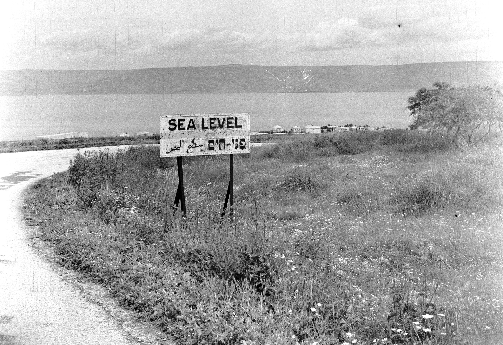

# chabar
Predicting sea levels from maritime archaeological remains in Israel.

By Willem van de Poll - [1], 1945-1989], Nummer toegang 2.24.14.02 Bestanddeelnummer 255-0181.
This is an image from the Nationaal Archief, the Dutch National Archives, donated in the context of a partnership program.
https://commons.wikimedia.org/w/index.php?curid=36604470

**Chabar**     
_associate, companion, friend, comrade, fellow_    
Origin: Aramaic    
Phonetic spelling: khab-ar    
